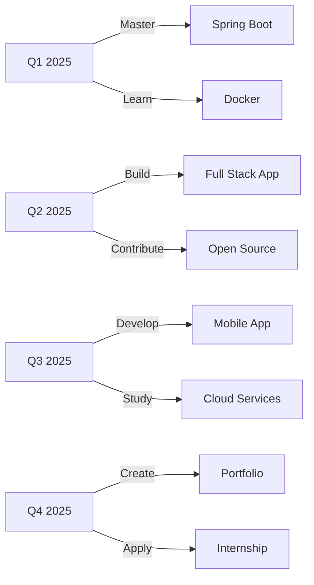

<!-- 🌟 Fahry Aditya Setiawan - Enhanced 2025 GitHub Profile -->

<!-- Animated Header -->
<p align="center">
  
</p>

<!-- Profile Picture with Glow Effect -->
<p align="center">
  
</p>

<!-- Dynamic Typing Animation -->
<p align="center">
  
</p>

<!-- Social Badges with Animations -->
<p align="center">
  <a href="https://www.tiktok.com/@ryu.kitasan?_r=1&_t=ZS-93HcLucUWer">
    
  </a>
  <a href="https://www.instagram.com/takumaharuto?igsh=MWJzZmp6c2pyeGwyZQ==">
    
  </a>
  <a href="https://github.com/FahryAditya">
    
  </a>
  
</p>


## 🎯 About Me


```yaml
name: Fahry Aditya Setiawan
alias: Ryu Kitasan
age: 15
education: SMK Student
location: Indonesia 🇮🇩
role: Programmer Robotika | Java Developer
passion: 
  - Coding & Innovation
  - Robotics & Automation
  - Clean Code Architecture
  - UI/UX Design
dream: Professional Software Engineer
motto: "Code is poetry written in logic"
```

<br clear="right"/>

### 💡 What I Do
- 🤖 **Robotics Programming** - Building intelligent automation systems
- ☕ **Java Development** - Creating robust backend applications
- 🎨 **UI/UX Design** - Crafting beautiful user experiences
- 🧩 **Problem Solving** - Turning complex challenges into elegant solutions
- 🌐 **Full Stack** - Exploring modern web technologies

### 🌱 Currently Learning
- 🍃 Spring Boot & Microservices Architecture
- 🗄️ MySQL Database Optimization
- 🔌 RESTful API Design & Integration
- 📱 Flutter for Cross-Platform Development
- 🧠 Design Patterns & Clean Code Principles


## 🏆 Achievements & Milestones

<table align="center">
  <tr>
    <td align="center" width="25%">
      <br/>
      <b>4+ Projects</b><br/>
      <sub>Database Integrated Apps</sub>
    </td>
    <td align="center" width="25%">
      <br/>
      <b>Logic Games</b><br/>
      <sub>CLI Problem Solving Tools</sub>
    </td>
    <td align="center" width="25%">
      <br/>
      <b>Exploring</b><br/>
      <sub>Modern Architecture</sub>
    </td>
    <td align="center" width="25%">
      <br/>
      <b>UI/UX</b><br/>
      <sub>Mobile Prototypes</sub>
    </td>
  </tr>
</table>


## 🛠️ Tech Arsenal

### 💻 Languages & Frameworks
<p align="center">
  
</p>

### 🌐 Web Technologies
<p align="center">
  
</p>

### 🗄️ Databases & Tools
<p align="center">
  
</p>

### 🔧 Hardware & Robotics
<p align="center">
  
  
</p>


## 📊 GitHub Analytics

<div align="center">
  
  
</div>

<div align="center">
  
</div>

<!-- Contribution Graph -->
<div align="center">
  
</div>

<br/>

<!-- Trophy Display -->
<div align="center">
  
</div>


## 📁 Project Portfolio

<div align="center">

| 🎯 Category | 📊 Count | 🔥 Status |
|------------|---------|----------|
| ☕ Java Projects | 4 |  |
| 🌐 Web Projects | 3 |  |
| 🖥️ CLI Tools | 2 |  |
| 🤖 Robotics | 5 |  |
| 📱 Mobile Apps | 2 |  |

</div>

### 🚀 Featured Projects

<details>
<summary><b>🎮 Java Game Engine</b> - Interactive CLI Game Framework</summary>
<br/>
<ul>
  <li>🎯 Turn-based game logic with OOP principles</li>
  <li>💾 Save/Load system with serialization</li>
  <li>🎨 ASCII art rendering engine</li>
  <li>🔧 Tech: Java, File I/O, Data Structures</li>
</ul>
</details>

<details>
<summary><b>🌐 Personal Portfolio Website</b> - Modern Responsive Design</summary>
<br/>
<ul>
  <li>⚡ Fast loading with optimized assets</li>
  <li>📱 Mobile-first responsive design</li>
  <li>🎨 Dark/Light mode toggle</li>
  <li>🔧 Tech: HTML, CSS, JavaScript, Tailwind</li>
</ul>
</details>

<details>
<summary><b>🤖 Arduino Line Follower</b> - Autonomous Robot</summary>
<br/>
<ul>
  <li>🔬 PID control algorithm implementation</li>
  <li>📡 IR sensor array integration</li>
  <li>⚙️ Motor speed optimization</li>
  <li>🔧 Tech: Arduino, C++, Electronics</li>
</ul>
</details>


## 🎯 2025 Goals & Roadmap



### 📋 Current Tasks
- [x] Complete Spring Boot basics
- [x] Build REST API with authentication
- [ ] Deploy app to cloud platform
- [ ] Contribute to 3 open-source projects
- [ ] Master Flutter development
- [ ] Build production-ready portfolio


## 💬 Daily Dev Quote

<div align="center">
  
</div>


## 🎵 Coding Soundtrack

<p align="center">
  
</p>

<p align="center">
  
</p>

### 🎧 Current Playlist

<table align="center">
  <tr>
    <td align="center" width="200">
      <br/>
      <b>🎵 Umapyoi Densetsu</b><br/>
      <sub>Uma Musume</sub>
    </td>
    <td align="center" width="200">
      <br/>
      <b>🎵 Tracen Ondo</b><br/>
      <sub>Uma Musume: Pretty Derby</sub>
    </td>
    <td align="center" width="200">
      <br/>
      <b>🎵 Otsukare Summer</b><br/>
      <sub>HALCALI</sub>
    </td>
  </tr>
  <tr>
    <td align="center">
      <br/>
      <b>🎵 Please Please</b><br/>
      <sub>Ayaka Osashi</sub>
    </td>
    <td align="center">
      <br/>
      <b>🎵 Grand Escape</b><br/>
      <sub>Radwimps</sub>
    </td>
    <td align="center">
      <br/>
      <b>🎵 Winning the Seoul</b><br/>
      <sub>Oguri Cap</sub>
    </td>
  </tr>
</table>


## 📊 Weekly Development Breakdown

<!--START_SECTION:waka-->
```text
Java         12 hrs 30 mins  ████████████░░░░░░░░░  48.2%
HTML/CSS      5 hrs 15 mins  ████░░░░░░░░░░░░░░░░░  20.3%
JavaScript    4 hrs 20 mins  ███░░░░░░░░░░░░░░░░░░  16.8%
Arduino       2 hrs 45 mins  ██░░░░░░░░░░░░░░░░░░░  10.6%
Others        1 hr 5 mins    █░░░░░░░░░░░░░░░░░░░░   4.1%
```
<!--END_SECTION:waka-->


## 🤝 Let's Connect & Collaborate!

<p align="center">
  <a href="https://www.tiktok.com/@ryu.kitasan?_r=1&_t=ZS-93HcLucUWer">
    
  </a>
  <a href="https://www.instagram.com/takumaharuto?igsh=MWJzZmp6c2pyeGwyZQ==">
    
  </a>
  <a href="https://github.com/FahryAditya">
    
  </a>
</p>

<p align="center">
  
  
  
</p>


## 🌟 Support My Journey

<p align="center">
  <a href="https://github.com/FahryAditya">
    
  </a>
  <a href="https://github.com/FahryAditya?tab=repositories">
    
  </a>
</p>

<p align="center">
  <i>⭐ Star my repositories if you find them useful!</i><br/>
  <i>🔔 Follow for updates on new projects!</i><br/>
  <i>💡 Feel free to reach out for collaboration!</i>
</p>


<!-- Snake Animation -->
<div align="center">
  
</div>


<!-- Footer Wave -->
<p align="center">
  
</p>

<p align="center">
  <sub>Made with 💙 by Ryu Kitasan | Last Updated: January 2026</sub><br/>
  <sub>© 2026 Fahry Aditya Setiawan. All Rights Reserved.</sub>
</p>