<!-- 🌟 Fahry Aditya Setiawan - Epic 2026 GitHub Profile -->

<!-- Animated Header with Particles -->
<p align="center">
  
</p>

<!-- Epic Profile Banner -->
<div align="center">
  
</div>

<!-- 3D Profile Picture with Glow -->
<p align="center">
  
</p>

<!-- Epic Typing Animation with Multiple Lines -->
<p align="center">
  
</p>

<!-- Advanced Social Badges with Stats -->
<p align="center">
  <a href="https://www.tiktok.com/@ryu.kitasan?_r=1&_t=ZS-93HcLucUWer">
    
  </a>
  <a href="https://www.instagram.com/takumaharuto?igsh=MWJzZmp6c2pyeGwyZQ==">
    
  </a>
  <a href="https://github.com/FahryAditya">
    
  </a>

  <br/><br/>
  
  
  
</p>


## 🎯 EPIC DEVELOPER PROFILE

<table align="center">
<tr>
<td width="50%" valign="top">

### 🚀 Quick Stats

```yaml
⚡ Developer ID
├─ Name: Fahry Aditya Setiawan
├─ Alias: Ryu Kitasan 🐎
├─ Age: 15 Years Old
├─ Status: SMK Student 📚
├─ Location: Indonesia 🇮🇩
└─ Timezone: UTC+8 (WITA)

💼 Professional Role
├─ Primary: Robotics Programmer 🤖
├─ Secondary: Java Backend Engineer ☕
├─ Specialty: Clean Architecture 🏗️
└─ Focus: Innovation & Automation ⚙️

🎯 Mission Statement
├─ Vision: Professional Software Engineer
├─ Goal: Build Impactful Solutions
├─ Values: Quality, Innovation, Learning
└─ Motto: "Code is Poetry in Logic" 📜

🔥 Current Status
├─ Learning: Spring Boot Ecosystem 🍃
├─ Building: Full-Stack Projects 🌐
├─ Exploring: Cloud Technologies ☁️
└─ Contributing: Open Source 🌍
```

</td>
<td width="50%" valign="top">

### 💎 Expertise Matrix

```javascript
const ryuKitasan = {
    pronouns: "He/Him",
    code: [
        "Java", "C++", "C", "Python",
        "Dart", "JavaScript", "Assembly"
    ],
    askMeAbout: [
        "Robotics", "Backend Dev",
        "Clean Code", "UI/UX",
        "System Design", "Automation"
    ],
    technologies: {
        backend: {
            java: ["Spring Boot", "JPA", "Hibernate"],
            frameworks: ["Jakarta EE", "Maven", "Gradle"]
        },
        frontend: {
            web: ["HTML5", "CSS3", "JavaScript"],
            frameworks: ["React", "Tailwind", "Bootstrap"]
        },
        mobile: {
            crossPlatform: ["Flutter", "Dart"]
        },
        databases: [
            "MySQL", "PostgreSQL", "MongoDB"
        ],
        devOps: [
            "Git", "Docker", "Linux", "CI/CD"
        ],
        hardware: [
            "Arduino", "Raspberry Pi",
            "Sensors", "Motors", "IoT"
        ]
    },
    architecture: [
        "Microservices", "MVC", "REST API",
        "Clean Architecture", "SOLID Principles"
    ],
    currentFocus: "Building Scalable Systems",
    funFact: "I debug code faster than I debug life 🐛"
};
```

</td>
</tr>
</table>


## 🏆 EPIC ACHIEVEMENTS & MILESTONES

<div align="center">
  
### 🎖️ Achievement Showcase

<table>
<tr>
<td align="center" width="20%">
<br/>
<br/>
<b>🔥 Database Apps</b><br/>
<sub>Advanced CRUD Systems</sub>
</td>
<td align="center" width="20%">
<br/>
<br/>
<b>⚡ Logic Games</b><br/>
<sub>CLI & GUI Applications</sub>
</td>
<td align="center" width="20%">
<br/>
<br/>
<b>🚀 Microservices</b><br/>
<sub>Modern Architecture</sub>
</td>
<td align="center" width="20%">
<br/>
<br/>
<b>⚙️ Automation</b><br/>
<sub>Smart Robot Systems</sub>
</td>
<td align="center" width="20%">
<br/>
<br/>
<b>💎 Interfaces</b><br/>
<sub>Beautiful Experiences</sub>
</td>
</tr>
</table>

### 🎯 Skill Level Indicators

```text
Java           ██████████████████████░░  90%  🔥 Expert Level
Robotics       █████████████████████░░░  85%  🤖 Advanced
Spring Boot    ████████████████░░░░░░░░  70%  🍃 Intermediate+
Flutter        ████████████░░░░░░░░░░░░  60%  📱 Growing
MySQL          ██████████████████░░░░░░  80%  🗄️ Proficient
Web Dev        ████████████████░░░░░░░░  75%  🌐 Skilled
UI/UX Design   █████████████████░░░░░░░  77%  🎨 Creative
Git & GitHub   ███████████████████░░░░░  82%  📂 Version Control Pro
```

</div>


## 🛠️ ULTIMATE TECH STACK

<div align="center">

### 💻 Programming Languages
<br/>


### 🎯 Frameworks & Libraries
<br/>


### 🗄️ Databases & Storage


### 🔧 Tools & Platforms
<br/>


### ⚡ Hardware & Embedded Systems
<p>
  
  
  
  
  
  
</p>

### 🎨 Design & Creative Tools
<p>
  
  
  
  
</p>

</div>


## 📊 ADVANCED GITHUB STATISTICS

<div align="center">

### 📈 Comprehensive Activity Overview

<table>
<tr>
<td width="50%">


</td>
<td width="50%">


</td>
</tr>
</table>

### 🎯 Language Distribution & Activity

<table>
<tr>
<td width="50%">


</td>
<td width="50%">


</td>
</tr>
</table>

### 🏆 Trophy Showcase


### 📊 Detailed Contribution Graph


### 💻 Most Used Technologies


### 📌 Code Metrics

<table align="center">
<tr>
<td align="center" width="25%">
<br/>
<sub>Consistency is key</sub>
</td>
<td align="center" width="25%">
<br/>
<sub>Quality projects</sub>
</td>
<td align="center" width="25%">
<br/>
<sub>Collaboration wins</sub>
</td>
<td align="center" width="25%">
<br/>
<sub>Problem solver</sub>
</td>
</tr>
</table>

</div>


## 🚀 FEATURED PROJECTS

<div align="center">

### 💎 Project Showcase

<table>
<tr>
<td width="50%" valign="top">

### ☕ Java Database Applications

[](https://github.com/FahryAditya)

**🎯 Hospital Management System**
- Full-featured CRUD operations
- MySQL database integration
- Swing GUI with modern design
- Patient & doctor management
- Appointment scheduling system

**💡 Tech Stack:**
`Java` `MySQL` `Swing` `JDBC` `MVC Pattern`

**🌟 Highlights:**
- Clean architecture implementation
- RESTful API design
- Comprehensive error handling
- Unit testing coverage

</td>
<td width="50%" valign="top">

### 🤖 Robotics Projects

[](https://github.com/FahryAditya)

**⚙️ Line Following Robot**
- PID control algorithm
- Sensor calibration system
- Speed optimization
- Autonomous navigation

**💡 Tech Stack:**
`Arduino` `C++` `IR Sensors` `Motors` `PID`

**🌟 Highlights:**
- Real-time sensor processing
- Adaptive control system
- Competition-ready design
- Modular architecture

</td>
</tr>
<tr>
<td width="50%" valign="top">

### 🍃 Spring Boot Projects

[](https://github.com/FahryAditya)

**🌐 E-Commerce REST API**
- RESTful API architecture
- JWT authentication
- MySQL database
- Product & order management
- User authentication system

**💡 Tech Stack:**
`Spring Boot` `JPA` `MySQL` `JWT` `Maven`

**🌟 Highlights:**
- Microservices architecture
- Security best practices
- API documentation with Swagger
- Docker containerization

</td>
<td width="50%" valign="top">

### 🎮 Game Development

[](https://github.com/FahryAditya)

**🎯 Strategy Games Collection**
- CLI-based games
- Advanced AI opponents
- Score tracking system
- Multiple difficulty levels

**💡 Tech Stack:**
`Java` `OOP` `Algorithms` `Data Structures`

**🌟 Highlights:**
- Object-oriented design
- Efficient algorithms
- User-friendly interface
- Extensible architecture

</td>
</tr>
</table>

### 📂 More Projects

<p>
  <a href="https://github.com/FahryAditya?tab=repositories">
    
  </a>
</p>

</div>


## 🌱 CURRENT LEARNING JOURNEY

<div align="center">

### 📚 What I'm Learning Right Now

<table>
<tr>
<td align="center" width="33%">
<br/>
<b>🍃 Spring Ecosystem</b><br/>
<sub>Microservices & Cloud</sub><br/>

</td>
<td align="center" width="33%">
<br/>
<b>🐳 Containerization</b><br/>
<sub>DevOps & Deployment</sub><br/>

</td>
<td align="center" width="33%">
<br/>
<b>☁️ Cloud Computing</b><br/>
<sub>AWS Services & Architecture</sub><br/>

</td>
</tr>
</table>

### 🎯 2026 Learning Roadmap

```mermaid
graph LR
    A[✅ Java Mastery] --> B[🔄 Spring Boot]
    B --> C[📚 Microservices]
    C --> D[🎯 Cloud Computing]
    D --> E[🚀 DevOps]
    E --> F[💡 System Design]
    
    style A fill:#00FF00
    style B fill:#FFFF00
    style C fill:#FFA500
    style D fill:#FF6B6B
    style E fill:#8A2BE2
    style F fill:#00FFFF
```



### 📖 Learning Resources

<table>
<tr>
<td align="center" width="25%">
📚<br/><b>Books</b><br/>
<sub>Effective Java, Clean Code</sub>
</td>
<td align="center" width="25%">
🎥<br/><b>Courses</b><br/>
<sub>Udemy, Coursera, YouTube</sub>
</td>
<td align="center" width="25%">
💻<br/><b>Practice</b><br/>
<sub>LeetCode, HackerRank</sub>
</td>
<td align="center" width="25%">
🌐<br/><b>Communities</b><br/>
<sub>Stack Overflow, GitHub</sub>
</td>
</tr>
</table>

</div>


## 💡 CODING PHILOSOPHY & PRINCIPLES

<div align="center">

### 🎯 Core Development Principles

<table>
<tr>
<td width="50%" valign="top">

#### 📜 SOLID Principles

```java
// Single Responsibility Principle
class UserService {
    // Only handles user operations
    public void createUser(User user) { }
    public void updateUser(User user) { }
}

// Open/Closed Principle
interface PaymentProcessor {
    void processPayment(Payment payment);
}

// Liskov Substitution Principle
class CreditCardProcessor implements PaymentProcessor {
    @Override
    public void processPayment(Payment payment) { }
}

// Interface Segregation Principle
interface Readable {
    void read();
}

interface Writable {
    void write();
}

// Dependency Inversion Principle
class OrderService {
    private final PaymentProcessor processor;
    
    public OrderService(PaymentProcessor processor) {
        this.processor = processor;
    }
}
```

</td>
<td width="50%" valign="top">

#### 🏗️ Clean Code Practices

```java
// ❌ Bad Practice
public void d(int x, int y) {
    int z = x + y;
    System.out.println(z);
}

// ✅ Good Practice
public void calculateAndDisplaySum(
    int firstNumber, 
    int secondNumber
) {
    int sum = firstNumber + secondNumber;
    displayResult(sum);
}

private void displayResult(int result) {
    System.out.println(
        "The sum is: " + result
    );
}

// ✅ Meaningful Names
class UserRegistrationService {
    private final EmailValidator emailValidator;
    private final PasswordEncoder passwordEncoder;
    
    public RegistrationResult registerNewUser(
        UserRegistrationRequest request
    ) {
        // Clear, self-documenting code
        validateEmail(request.getEmail());
        String encodedPassword = 
            encodePassword(request.getPassword());
        
        return saveUser(request, encodedPassword);
    }
}
```

</td>
</tr>
</table>

### 💭 Development Mantras

<table>
<tr>
<td align="center" width="25%">
<br/>
<b>✨ Quality Over Quantity</b><br/>
<sub>Write code that others can read</sub>
</td>
<td align="center" width="25%">
<br/>
<b>🧪 Test Everything</b><br/>
<sub>If it's not tested, it's broken</sub>
</td>
<td align="center" width="25%">
<br/>
<b>🎯 KISS Principle</b><br/>
<sub>Simplicity is the ultimate sophistication</sub>
</td>
<td align="center" width="25%">
<br/>
<b>🔄 Continuous Improvement</b><br/>
<sub>Code is never finished, only shipped</sub>
</td>
</tr>
</table>

### 🎨 Code Style Guide

```yaml
🎯 Naming Conventions:
  Classes: PascalCase (UserService, PaymentProcessor)
  Methods: camelCase (getUserById, processPayment)
  Constants: UPPER_SNAKE_CASE (MAX_RETRY_COUNT)
  Variables: camelCase (userName, totalAmount)

📝 Code Organization:
  - Group related methods together
  - Use meaningful package structure
  - Keep classes focused and small
  - Document complex logic

🔍 Code Review Checklist:
  ✅ Is the code readable?
  ✅ Are names meaningful?
  ✅ Is error handling proper?
  ✅ Are there unit tests?
  ✅ Is it documented?
  ✅ Follows project standards?
```

</div>


## 🤝 COLLABORATION & CONTRIBUTIONS

<div align="center">

### 🌟 Open for Collaboration

<table>
<tr>
<td align="center" width="25%">
<br/>
<b>Open Source</b><br/>
<sub>Let's build amazing things together!</sub>
</td>
<td align="center" width="25%">
<br/>
<b>Knowledge Exchange</b><br/>
<sub>Always eager to learn and share</sub>
</td>
<td align="center" width="25%">
<br/>
<b>Internships & Projects</b><br/>
<sub>Ready for real-world challenges</sub>
</td>
<td align="center" width="25%">
<br/>
<b>Tech Community</b><br/>
<sub>Connect with fellow developers</sub>
</td>
</tr>
</table>

### 📧 Get In Touch

```javascript
const contactInfo = {
    email: "Contact via GitHub or Social Media",
    location: "Indonesia 🇮🇩",
    timezone: "UTC+8 (WITA)",
    availability: {
        collaboration: "✅ Open",
        freelance: "✅ Available",
        fulltime: "🔜 Future",
        mentorship: "✅ Always"
    },
    responseTime: "< 24 hours ⚡",
    languages: ["Indonesian 🇮🇩", "English 🇺🇸", "日本語 🇯🇵 (Learning)"]
};

// Feel free to reach out for:
// - Project collaborations 🤝
// - Technical discussions 💡
// - Code reviews 🔍
// - Robotics enthusiasts 🤖
// - Anime & coding talks 🎌
```

### 🎯 Current Status

<p align="center">
  
  
  
</p>

</div>


## 🌟 SUPPORT MY JOURNEY

<div align="center">

### ⭐ Show Your Support

<p>
  <a href="https://github.com/FahryAditya">
    
  </a>
  <a href="https://github.com/FahryAditya?tab=repositories">
    
  </a>
</p>

### 💖 Ways to Support

<table>
<tr>
<td align="center" width="25%">
⭐<br/><b>Star Repos</b><br/>
<sub>Help projects gain visibility</sub>
</td>
<td align="center" width="25%">
👁️<br/><b>Watch Updates</b><br/>
<sub>Stay tuned for new features</sub>
</td>
<td align="center" width="25%">
🔄<br/><b>Share Projects</b><br/>
<sub>Spread the word</sub>
</td>
<td align="center" width="25%">
💬<br/><b>Give Feedback</b><br/>
<sub>Help me improve</sub>
</td>
</tr>
</table>

### 🎁 Special Thanks To

<p>
  
</p>

<sub>🙏 Every star, fork, and contribution means the world to me!</sub>

</div>


## 🎮 FUN FACTS & EXTRAS

<div align="center">

### 🎯 Quick Facts About Me

```javascript
const funFacts = {
    favoriteLanguage: "Java ☕ (It's in my blood!)",
    codingStyle: "Clean, documented, and maintainable",
    debugging: "console.log() is my best friend 😅",
    editor: "VSCode with custom themes 🎨",
    coffeeIntake: "~4 cups/day ☕☕☕☕",
    musicWhileCoding: "Always! 🎵",
    favoriteAnime: "Uma Musume Pretty Derby 🏇",
    hobbies: [
        "🤖 Building robots",
        "🎮 Gaming (strategy games)",
        "📚 Reading tech blogs",
        "🎵 Listening to J-Pop",
        "🏃 Occasional running"
    ],
    lifePhilosophy: "Continuous learning & improvement 📈",
    dreamSetup: "Multi-monitor with mechanical keyboard ⌨️",
    currentlyWatching: "Tech YouTube tutorials 📺",
    weekendVibes: "Coding side projects 💻"
};
```

### 🎲 Random Dev Humor


### 🏆 Badges Collection

<p>
  
  
  
  
  
  
  
  
</p>

</div>


<!-- Epic Snake Animation -->
<div align="center">
  
</div>


<!-- Epic Footer -->
<p align="center">
  
</p>

<div align="center">
  
  
  <h3>🎯 Keep Coding, Keep Creating! 🚀</h3>
  
  <p>
    
    
    
  </p>
  
  <sub>
    <b>✨ Created by Ryu Kitasan (Fahry Aditya Setiawan)</b><br/>
    📅 Last Updated: January 2026<br/>
    © 2026 All Rights Reserved | Made with ❤️ in Indonesia 🇮🇩<br/>
    <br/>
    <i>"The only way to do great work is to love what you do." - Steve Jobs</i>
  </sub>
  
  <br/><br/>
  
  
  
  
  
</div>

<!-- Visitor Counter Animation -->
<p align="center">
  
</p>

<!-- Final Divider -->


---

<div align="center">
  
### 💫 "Code is Poetry, Execution is Art" 💫


</div>
